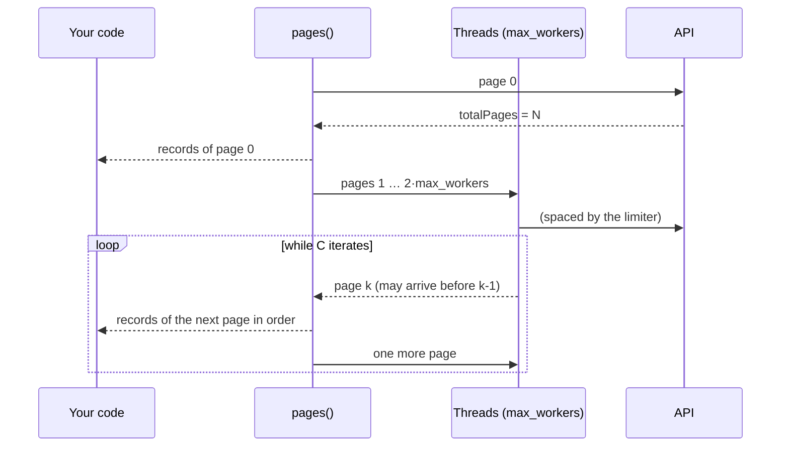

# How the client works

Three policies apply to every request, whatever the endpoint, and one design rule wraps them. This page explains the whole; each decision, with the alternatives it rejected, is in its [ADR](../adr/index.md).

## Rate limit: spaced, not bursty

Every request first goes through a [`RateLimiter`][bdns.fetch.utils.RateLimiter]. By default there is one per process ([`DEFAULT_RATE_LIMITER`][bdns.fetch.client.DEFAULT_RATE_LIMITER]), shared by every client and paging thread, spacing requests at 9.5 per second. It allows no bursts because the API rejects them even when the average complies ([measurement](api-behavior.md#rate-limit)). See [ADR 0003](../adr/0003-spaced-requests-no-bursts.md).

## Retries: transient failures only

What may succeed when repeated is retried (network, `429`, `5xx`, `ERR_MANTENIMIENTO_BBDD`), with exponential, jittered backoff, and nothing else. A repeated `400` is still a `400`. See the [errors guide](../guides/errors.md) and [ADR 0002](../adr/0002-retry-only-transient-failures.md).

## Pagination: in order, with bounded memory

Pages are requested in parallel (`max_workers` threads) through a sliding window of `2 × max_workers` requests in flight, and delivered **in page order**. A slow consumer slows the download instead of piling pages up in memory; a consumer that stops iterating cancels the pending requests. See [ADR 0005](../adr/0005-ordered-bounded-pagination.md).

## The rule around it: the client knows nothing about the CLI

The `fetch_*` methods are plain Python: keyword parameters named as the API names them ([ADR 0001](../adr/0001-api-parameter-names-keyword-only.md)), real defaults, accurate types and records as `dict` ([ADR 0004](../adr/0004-records-as-plain-dicts.md)). The CLI is generated from those signatures ([ADR 0006](../adr/0006-cli-generated-from-client.md)): adding an endpoint to the client adds the command.
