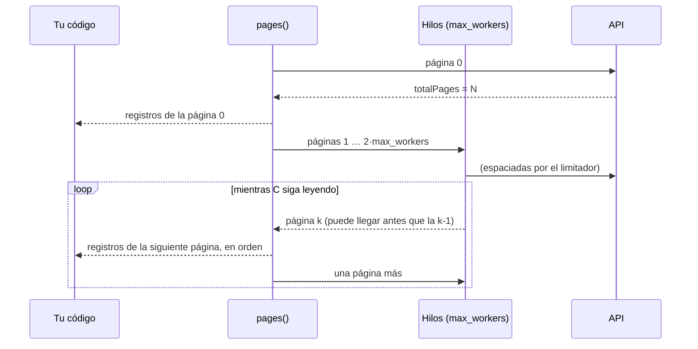

# Cómo trabaja el cliente

Hay tres reglas que se aplican a todas las peticiones, sea cual sea el endpoint, y un principio de diseño que las engloba. Aquí se explica el conjunto; el porqué de cada una, con las alternativas que se descartaron, está en las [decisiones de diseño](../adr/index.md).

## Límite de peticiones: espaciadas y sin ráfagas

Antes de salir, cada petición pasa por un [`RateLimiter`][bdns.fetch.utils.RateLimiter]. Por defecto hay uno solo para todo el proceso ([`DEFAULT_RATE_LIMITER`][bdns.fetch.client.DEFAULT_RATE_LIMITER]), compartido por todos los clientes, que espacia las peticiones a 9,5 por segundo. No deja pasar ráfagas porque la API las rechaza aunque la media esté dentro del límite ([las pruebas](api-behavior.md#rate-limit)). Lo explica la [decisión 0003](../adr/0003-spaced-requests-no-bursts.md).

## Reintentos: solo cuando tiene sentido

Se reintenta lo que puede salir bien a la segunda (errores de red, `429`, errores `5xx` y `ERR_MANTENIMIENTO_BBDD`), cada vez esperando más y con un margen aleatorio, y nada más. Un `400` repetido sigue siendo un `400`. Más detalles en la [guía de errores](../guides/errors.md) y en la [decisión 0002](../adr/0002-retry-only-transient-failures.md).

## Paginación: una llamada cada vez, en orden y sin acumular memoria

Por defecto las páginas se piden de una en una, como recomiendan las buenas prácticas oficiales ([decisión 0008](../adr/0008-one-call-at-a-time.md)). Las descargas grandes son posibles porque se dividen por fechas en tramos semanales, no porque se hagan llamadas en paralelo.

Si aun así quieres ir más rápido, `max_workers` permite varios hilos. En ese caso, como mucho hay `2 × max_workers` peticiones pendientes y las páginas se entregan **en su orden**, aunque terminen desordenadas. Si tu código va más despacio que la descarga, la descarga espera en lugar de acumular páginas en memoria, y si dejas de recorrer los resultados, las peticiones que quedaban se cancelan ([decisión 0005](../adr/0005-ordered-bounded-pagination.md)).

## El principio que lo engloba: el cliente no sabe nada de la terminal

Los métodos `fetch_*` son Python normal y corriente: los parámetros se pasan por nombre y se llaman igual que en la API ([decisión 0001](../adr/0001-api-parameter-names-keyword-only.md)), los valores por defecto son reales, los tipos son correctos y los registros llegan como `dict` ([decisión 0004](../adr/0004-records-as-plain-dicts.md)). La herramienta de terminal se construye a partir de esas firmas ([decisión 0006](../adr/0006-cli-generated-from-client.md)), de modo que al añadir un endpoint al cliente aparece también su comando.
