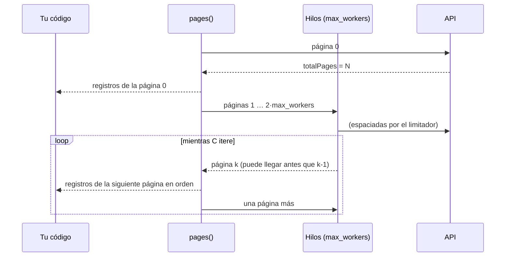

# Cómo trabaja el cliente

Tres políticas se aplican a toda petición, sea cual sea el endpoint, y una regla de diseño las envuelve. Esta página explica el conjunto; cada decisión, con sus alternativas descartadas, está en su [ADR](../adr/index.md).

## Límite de peticiones: espaciadas, no en ráfaga

Toda petición pasa antes por un [`RateLimiter`][bdns.fetch.utils.RateLimiter]. Por defecto es uno solo para todo el proceso ([`DEFAULT_RATE_LIMITER`][bdns.fetch.client.DEFAULT_RATE_LIMITER]), compartido por todos los clientes y los hilos de paginación, y espacia las peticiones a 9,5 por segundo. No permite ráfagas porque la API las rechaza aunque la media cumpla ([medición](api-behavior.md#rate-limit)). Ver [ADR 0003](../adr/0003-spaced-requests-no-bursts.md).

## Reintentos: solo lo transitorio

Se reintenta lo que puede salir bien repitiéndolo (red, `429`, `5xx`, `ERR_MANTENIMIENTO_BBDD`), con espera exponencial y aleatoria, y nada más. Un `400` repetido sigue siendo un `400`. Ver la [guía de errores](../guides/errors.md) y el [ADR 0002](../adr/0002-retry-only-transient-failures.md).

## Paginación: en orden y con memoria acotada

Las páginas se piden en paralelo (`max_workers` hilos) con una ventana deslizante de `2 × max_workers` peticiones en vuelo, y se entregan **en orden de página**. Si el consumidor es lento, la descarga se frena en vez de acumular páginas en memoria; si deja de iterar, las peticiones pendientes se cancelan. Ver [ADR 0005](../adr/0005-ordered-bounded-pagination.md).

## La regla que lo envuelve: el cliente no sabe nada del CLI

Los métodos `fetch_*` son Python normal: parámetros por nombre con el nombre de la API ([ADR 0001](../adr/0001-api-parameter-names-keyword-only.md)), defaults reales, tipos correctos y registros como `dict` ([ADR 0004](../adr/0004-records-as-plain-dicts.md)). El CLI se genera a partir de esas firmas ([ADR 0006](../adr/0006-cli-generated-from-client.md)): añadir un endpoint al cliente añade el comando.
