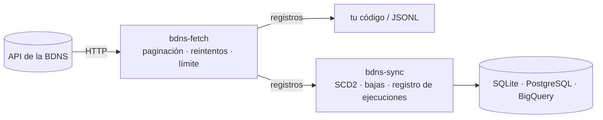

# BDNS Fetch

Cliente de Python y herramienta de línea de comandos para descargar datos de la API de la [Base de Datos Nacional de Subvenciones](https://www.infosubvenciones.es/) (BDNS). Cubre los 29 endpoints de consulta y se encarga por ti de la paginación, de los reintentos y del límite de peticiones que fija la API.

```console
$ pip install bdns
$ bdns-fetch convocatorias-busqueda --fechaDesde 2024-01-01 --num-pages 0 > convocatorias.jsonl
```

```python
from bdns.fetch import BDNSClient

for convocatoria in BDNSClient().fetch_convocatorias_busqueda(descripcion="investigación"):
    print(convocatoria["numeroConvocatoria"], convocatoria["descripcion"])
```

## Por dónde empezar

<div class="grid cards" markdown>

- :material-rocket-launch:{ .lg .middle } **Es la primera vez**

    ---

    Tu primera consulta desde la terminal y desde Python, en cinco minutos.

    [:octicons-arrow-right-24: Primeros pasos](getting-started.md)

- :material-calendar-sync:{ .lg .middle } **Quiero descargar por fechas**

    ---

    Cómo pedir rangos de fechas sin perder ni repetir días, cómo tratar los errores y cómo llamar a endpoints que no tienen método propio.

    [:octicons-arrow-right-24: Guías](guides/incremental.md)

- :material-lightbulb-on:{ .lg .middle } **Quiero entender la API**

    ---

    Cómo se comporta de verdad la API, comprobado contra el servicio real, y por qué el cliente hace lo que hace.

    [:octicons-arrow-right-24: Conceptos](explanation/api-behavior.md)

- :material-code-braces:{ .lg .middle } **Busco un detalle concreto**

    ---

    Todos los comandos y opciones, y la referencia de Python generada a partir del código.

    [:octicons-arrow-right-24: Referencia](reference/cli.md)

</div>

## Los dos proyectos

`bdns-fetch` se ocupa solo de **descargar**: sabe todo lo necesario sobre la API y nada sobre cómo guardar los datos. [`bdns-sync`](../sync/index.md) se apoya en él para mantener una copia local con histórico de versiones (SCD2) en cualquier base de datos compatible con SQLAlchemy.



## Aviso

Es un proyecto personal y no oficial, sin ninguna relación con la Intervención General de la Administración del Estado (IGAE), que es quien gestiona la BDNS. Algunos endpoints devuelven nombres y NIF de personas físicas, y su reutilización está limitada por las condiciones de la IGAE; las tienes resumidas en el [aviso legal del README](https://github.com/cruzlorite/bdns#aviso-legal).
