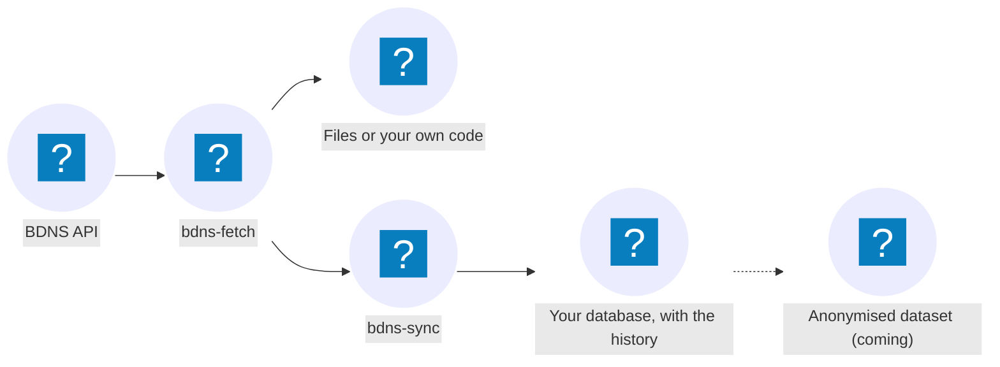

---
hide:
  - toc
---

<div class="bdns-hero" markdown>

# BDNS

<p class="bdns-tagline">Download, keep and reuse the data of Spain's National Subsidies Database through its public API, without having to fight it.</p>

[Get started with bdns-fetch :octicons-arrow-right-24:](fetch/getting-started.md){ .md-button .md-button--primary }
[Get started with bdns-sync :octicons-arrow-right-24:](sync/getting-started.md){ .md-button }

</div>

```console
$ pip install bdns                # for BigQuery: pip install "bdns[bigquery]"
```

## How it fits together



## Two tools, one package

<div class="grid cards" markdown>

- :material-cloud-download:{ .lg .middle } **BDNS Fetch**

    ---

    Python client and command-line tool for the API. It covers the 29 query endpoints and handles pagination, retries and the rate limit.

    [:octicons-arrow-right-24: Go to bdns-fetch](fetch/index.md)

- :material-database-sync:{ .lg .middle } **BDNS Sync**

    ---

    Keeps a copy of the BDNS, with the history of every version, in your database (SQLite, PostgreSQL, DuckDB or BigQuery), with one command a day.

    [:octicons-arrow-right-24: Go to bdns-sync](sync/index.md)

</div>

## Why use it

<div class="grid cards" markdown>

- :material-ruler-square:{ .lg .middle } **Measured, not assumed**

    ---

    Everything documented about the API (dates, limits, failures) has been measured against the real service, and nightly tests warn if it changes.

- :material-handshake-outline:{ .lg .middle } **Gentle with the API**

    ---

    One call at a time and spaced requests, as the IGAE's official good practices ask.

- :material-history:{ .lg .middle } **The whole history**

    ---

    `bdns-sync` keeps every version of every record, including what the portal eventually withdraws.

- :material-cog-off-outline:{ .lg .middle } **No configuration**

    ---

    A database URL and one command a day are enough.

</div>

!!! note "Unofficial project"

    This is a personal project, not affiliated with the IGAE, which runs the BDNS. If you reuse the data, you must meet its reuse conditions, summarised in the [README's legal notice](https://github.com/cruzlorite/bdns/blob/main/README.en.md#legal-notice).
