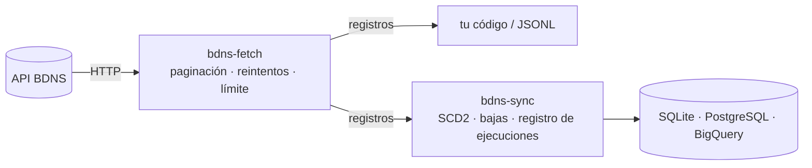

# BDNS Fetch

Cliente Python y CLI para la API de la [Base de Datos Nacional de
Subvenciones](https://www.infosubvenciones.es/). Los 29 endpoints de
consulta, con paginación, reintentos y el límite de peticiones de la API
aplicados por defecto.

```console
$ pip install bdns-fetch
$ bdns-fetch convocatorias-busqueda --fechaDesde 2024-01-01 --num-pages 0 > convocatorias.jsonl
```

```python
from bdns.fetch import BDNSClient

for convocatoria in BDNSClient().fetch_convocatorias_busqueda(descripcion="investigación"):
    print(convocatoria["numeroConvocatoria"], convocatoria["descripcion"])
```

## Por dónde empezar

<div class="grid cards" markdown>

- :material-rocket-launch:{ .lg .middle } **Nunca lo has usado**

    ---

    Primera consulta desde la terminal y desde Python, en cinco minutos.

    [:octicons-arrow-right-24: Empezar](getting-started.md)

- :material-calendar-sync:{ .lg .middle } **Descargar de forma incremental**

    ---

    Rangos de fechas sin perder ni duplicar días, errores y endpoints sin método propio.

    [:octicons-arrow-right-24: Guías](guides/incremental.md)

- :material-lightbulb-on:{ .lg .middle } **Entender la API**

    ---

    Cómo se comporta de verdad la API, medido contra el servicio real, y por qué el cliente hace lo que hace.

    [:octicons-arrow-right-24: Explicación](explanation/api-behavior.md)

- :material-code-braces:{ .lg .middle } **Consultar un detalle**

    ---

    El CLI y la API Python, generada desde los docstrings.

    [:octicons-arrow-right-24: Referencia](reference/cli.md)

</div>

## La familia

`bdns-fetch` es la capa de **extracción**: sabe todo lo que hay que saber de la API y nada de almacenamiento. [`bdns-sync`](https://cruzlorite.github.io/bdns-sync/) se apoya en ella para mantener una copia local versionada (SCD2) de los mismos datos en cualquier base de datos con dialecto de SQLAlchemy.



## Aviso

Proyecto no oficial, sin relación con la BDNS ni con el Ministerio de Hacienda. Algunos endpoints devuelven nombres y NIF de personas físicas; quien los descarga es responsable de tratarlos conforme al RGPD. Detalles en el [README](https://github.com/cruzlorite/bdns-fetch#aviso-legal).
