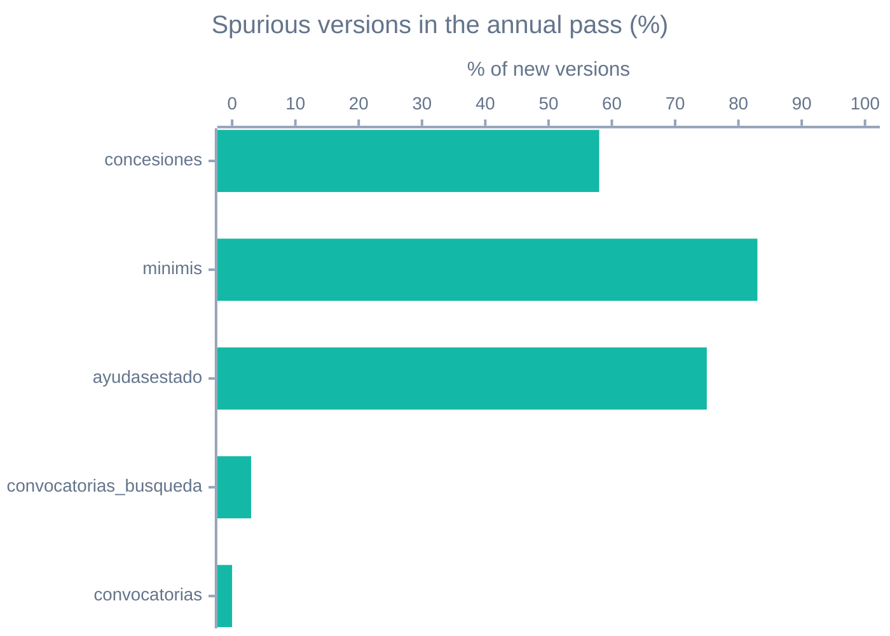

# How it syncs: windows, deletions and changes

What `bdns-sync` decides based on how the API behaves. Facts about the API itself (date semantics, failures on long ranges, retention, spurious changes), with their measurements, live in `bdns-fetch`'s documentation: [API behaviour](../../fetch/explanation/api-behavior.md). This page links them rather than repeating them.

## Inclusive ranges ending yesterday

In `bdns-sync`, a date range is **closed at both ends**: the `daily` window on day `X` means "the records of day `X`". The upper bound is always *yesterday* at the latest, because the current day keeps receiving records until the next morning, and a run covering it would leave a half-finished day behind that nothing revisits ([`windows`][bdns.sync.windows]).

## Dates are translated by bdns-fetch, never by hand

The API uses two opposite semantics for the upper bound: `fechaRegFin` is exclusive and `fechaHasta` inclusive ([measurement](../../fetch/explanation/api-behavior.md#upper-bound)). `bdns-sync` does not build those parameters: each entity passes its inclusive range through [`registration_range`](../../fetch/reference/api/dates.md) or [`period_range`](../../fetch/reference/api/dates.md), depending on its family. The rule lives in one place, the API's.

## 7-day pieces

Every range is split into pieces of at most 7 days before it is queried, with [`split_range`](../../fetch/reference/api/dates.md): long ranges fail intermittently and week-long ones do not ([measurement](../../fetch/explanation/api-behavior.md#range-reliability)). The `daily` and `weekly` windows fit in one piece; `monthly`, `annual` and backfills are split.

The pieces only affect how data is downloaded. The range handed to the sink, which scopes deletions, is the whole range asked for.

## Before each day, the API is checked

All of the above rests on measured, undocumented semantics. `bdns-sync delta` starts by running `bdns-fetch`'s contract check ([`check-api`](../../fetch/reference/cli.md#check-api)): if the API returns valid data contradicting the semantics, nothing is synced that day, because syncing through a changed boundary loses or duplicates records silently. An empty probe day or a passing error blocks nothing.

The tests also pin the same invariant (consecutive days disjoint and additive) against the fake client, so a regression in `bdns-sync` does not go unnoticed.

## Window-scoped deletion detection

Windowed entities that carry their own registration date (`concesiones_busqueda`, `ayudasestado_busqueda`, `minimis_busqueda`, `convocatorias_busqueda` and `convocatorias`, with `fechaAlta`, `fechaRegistro` or `fechaRecepcion` depending on the entity) detect real deletions by comparing, within the same run, what the API returns against the table rows whose registration date falls in that same range. A current row from that range that did not come back is closed with reason `removed`.

The comparison is never made against the previous run: it would produce constant false positives, since every row eventually leaves a rolling window without having been withdrawn.

`partidospoliticos_busqueda` is left out: its payload carries no registration-date field ([measurement](../../fetch/explanation/api-behavior.md#api-issues)), so there is nothing to scope the comparison by. It is a permanent limitation while the API stays as it is.

## How far back the history goes

Each windowed entity declares in the [entity registry][bdns.sync.entities] the date worth loading it from (`history_start`), and `bdns-sync backfill` loads it year by year from there:

| Entity | From | Why |
|---|---|---|
| `concesiones_busqueda`, `partidospoliticos_busqueda` | 2020 | ~4 years of retention |
| `ayudasestado_busqueda`, `minimis_busqueda` | 2015 | ~10 years of retention |
| `convocatorias_busqueda`, `convocatorias` | 2013 | portal start |

They are conservative floors, not first records: asking for dates before the retention ([measurement](../../fetch/explanation/api-behavior.md#history-depth)) only returns empty weeks, one cheap call each.

## Performance

- **One call at a time.** `bdns-fetch` spaces requests at 9.5 per second with no bursts, because the API rejects bursts ([measurement](../../fetch/explanation/api-behavior.md#rate-limit)), and by default makes one call at a time, as the official good practices ask. Pagination shows it most: syncing a week of awards (236,113 rows) into SQLite took 63 seconds one call at a time and 27 with `--max-workers 5`. The detail steps of `convocatorias` and `planesestrategicos` barely change while the server answers fast, since the rate limit already caps them; when the server is loaded it does show: a month of `convocatorias` (6,186 codes) once took 3 h 12 min one call at a time and 10 min 54 s with 8 at once ([how much several calls gain](../../fetch/explanation/api-behavior.md#concurrency)). Within the recommendation there is no more room on our side, since each page takes as long as the server needs to prepare and send it.
- **Producer/consumer overlap.** Loading staging overlaps downloading the next batch with writing the current one ([`pipeline`][bdns.sync.pipeline]): 40% faster on the endpoints where download dominates. Download runs on a helper thread and writing on the thread that owns the connection, because SQLite objects have thread affinity; the bounded queue provides backpressure.
- **BigQuery.** Staging is loaded with load jobs in batches of 50,000 rows, not `INSERT`: they are faster, use no DML quota and leave margin under the per-table update-operation limit ([`dialects`][bdns.sync.sinks.sql.dialects]).
- **Retries.** By default, 5 retries starting at 10 s (10, 20, 40, 60, 60 s): a request rides out about 3-4 minutes of trouble before the run fails. Set them with `--max-retries` and `--wait-time`.

## What it does about each known API issue

| Issue ([details](../../fetch/explanation/api-behavior.md#api-issues)) | What `bdns-sync` does |
|---|---|
| Single records arriving as an HTML error page | Skips them with a warning, counts them in `rows_skipped` and keeps the content in `_sync_errors`. If skips cross the threshold, the run fails ([ADR 0005](../adr/0005-per-run-reject-tolerance.md)) |
| `ERR_MANTENIMIENTO_BBDD` on long ranges | 7-day pieces; the client retries it as transient |
| Inconsistent date semantics | Translation in `bdns-fetch`, daily check with `check-api` |
| `partidospoliticos_busqueda` without a registration date | No deletion detection for that entity |
| Nested arrays in changing order | The hash sorts keys and elements recursively |
| Unstable pagination on recent dates | Identical copies are deduplicated on insert; a massive one-pass historical load may leave a residual pair ([how to find it](data-caveats.md)) |
| Rewritten names and shuffled lists | Per-entity hash rules; see below |

## Spurious changes: what counts as a change

The API sometimes returns the same data written differently ([the three families](../../fetch/explanation/api-behavior.md#spurious-changes)). For an SCD2 history each one is a version that adds nothing. Measured on the annual pass of 1 September 2026, comparing each new version with the one it closed:

| Entity | Versions | Spurious | Culprit field |
|---|---|---|---|
| `concesiones_busqueda` | 368,818 | **213,176 (58%)** | `beneficiario` |
| `minimis_busqueda` | 35,995 | **30,033 (83%)** | `sectorActividad` |
| `ayudasestado_busqueda` | 6,758 | **5,046 (75%)** | `sectores` |
| `grandesbeneficiarios_busqueda` | ~65,000 a day | **~100%** | `beneficiario` |
| `convocatorias` | 2,366 | 0 | — |
| `convocatorias_busqueda` | 437 | 13 (3%) | — |
| `partidospoliticos_busqueda` | 21 | 1 | — |

Of the 414,395 versions of that pass, about 248,000 were noise: 60%.

### The criterion for excluding a field from the hash

A field leaves the hash **only if its value oscillates**, that is, if it returns to values it already had. That tells a field the API rewrites at random apart from one receiving real corrections, and avoids excluding by analogy.

The test: for each natural key with three or more versions, take the field's sequence of values, drop consecutive repeats, and check whether any value reappears after a different one.

| Entity | Field | Keys that change | Oscillate | Verdict |
|---|---|---|---|---|
| `concesiones_busqueda` | `beneficiario` | 177 | **119 (67%)** | random, out of the hash |
| `grandesbeneficiarios_busqueda` | `beneficiario` | — | hash cycle proven | random, out of the hash |
| `ayudasestado_busqueda` | `beneficiario` | 2 | 0 | sample too small, kept |
| `minimis_busqueda` | `beneficiario` | 0 | — | sample too small, kept |
| `concesiones_busqueda` | `convocatoria` | 1 | 0 | sample too small, kept |

Where the sample is too small the field **stays in the hash**: the volume is low and, when in doubt, recording the change is preferred. The measurement is worth repeating once the history is longer.

### Which rules apply

Four, declared in the [entity registry][bdns.sync.entities] next to each entity's natural key:

| Entity | Rule | Reason |
|---|---|---|
| `concesiones_busqueda` | `hash_exclude=("beneficiario",)` | proven oscillation, 67% |
| `grandesbeneficiarios_busqueda` | `hash_exclude=("beneficiario",)` | oscillation proven by hash cycle |
| `ayudasestado_busqueda` | `delimited_lists={"sectores": "#"}` | 84% of its changes were reordering |
| `minimis_busqueda` | `delimited_lists={"sectorActividad": ...}` | 92% of its changes were reordering |

The two families are treated differently on purpose. A shuffled list can be canonicalised without losing information, so it is sorted before hashing and the field still detects real changes. A name rewritten at random cannot be canonicalised without deciding which spelling is right, so the field leaves the hash entirely. In both cases **only what the hash sees changes**: the payload is stored exactly as the API returned it ([why that is safe](payload-policy.md)).

### How a shuffled list is split

In `minimis_busqueda` elements are joined by `;`, but several CNAE descriptions carry a `;` of their own, so splitting at every `;` would cut 374 of 15,931 elements in half. The rule splits **before the start of an element** (a code followed by a hyphen), leaving those descriptions whole: zero malformed elements on the same data. In `ayudasestado_busqueda`, `#` is unambiguous.

A pattern that stopped recognising the codes degrades in the safe direction: the value is not split, not sorted, and reordering produces versions again. It can never merge two different lists, since sorting keeps the elements.

### Fields that disappear and come back

The third family, fields that arrive `null` and come back filled ([measurement](../../fetch/explanation/api-behavior.md#intermittent-fields)), **cannot be fixed with hash rules**. A `null` cannot be normalised: either it counts as a change, or the field is excluded and the detection of when a deadline is really set is lost, which is legitimate information. Those versions are accepted as valid; they are about 650 of the 4,320 closed versions of `convocatorias`. What to keep in mind when querying is in [before querying the data](data-caveats.md).
