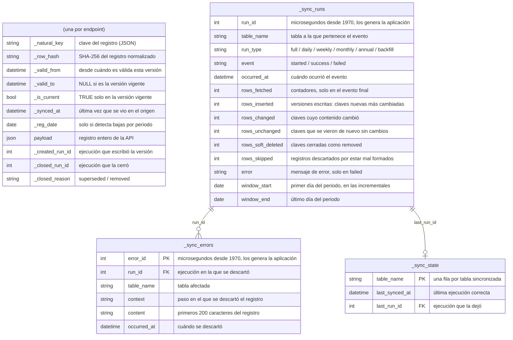
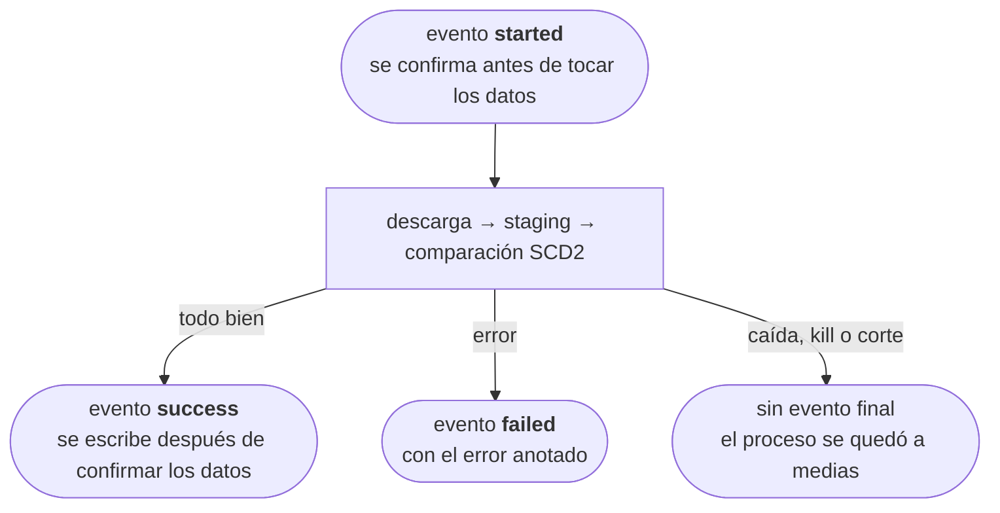

# Modelo de datos

Estas son las tablas que `bdns-sync` crea en la base de datos de destino: una por entidad y tres de control que comparten todas.

Todas las tablas de entidad tienen las mismas columnas, sin campos propios de cada endpoint. El registro original se guarda entero en `payload`, y el resto de columnas sirven para llevar el control de las versiones (SCD2):

| Columna | Qué guarda |
|---|---|
| `_natural_key` | La clave que identifica al registro (sus campos clave, en JSON). Junto con `_valid_from` identifica cada versión |
| `_row_hash` | El SHA-256 del registro normalizado, que permite detectar cambios sin comparar campo a campo. Al normalizarlo se ordenan las claves de los objetos **y los elementos de las listas**, de forma recursiva, porque la API devuelve las listas anidadas en un orden que cambia de una llamada a otra (lo explicamos en [qué hace con cada problema conocido de la API](../explanation/sync-behavior.md#api-issues)) |
| `_valid_from` / `_valid_to` | Desde cuándo y hasta cuándo ha sido válida esta versión. `_valid_to` vale `NULL` mientras es la vigente |
| `_is_current` | `True` en la versión vigente de cada clave |
| `_synced_at` | La última vez que se vio esta versión en el origen (se actualiza aunque no haya cambios) |
| `_reg_date` | La fecha de registro que trae el propio registro. Solo se rellena en las entidades que detectan bajas por periodo; en el resto vale `NULL` |
| `payload` | El registro completo tal y como lo devuelve la API, en JSON (en una columna de texto, para que funcione igual en todas las bases de datos) |
| `_created_run_id` | La ejecución que escribió esta versión (`_sync_runs.run_id`) |
| `_closed_run_id` | La ejecución que la cerró; `NULL` mientras está vigente |
| `_closed_reason` | Por qué se cerró: `superseded` (la sustituyó un contenido distinto) o `removed` (la API dejó de devolver la clave); `NULL` mientras está vigente |

Las tres columnas de ejecución valen `NULL` en las versiones escritas antes de que existieran ([decisión 0008](../adr/0008-run-linked-versions-additive-migrations.md)).

Si la API añade o quita un campo no hay que cambiar nada: el cambio se detecta por el hash y se guarda como una versión más.



## Tablas de control

Son comunes a todas las entidades y empiezan por `_sync_`:

- **`_sync_state`**: una fila por tabla con la fecha de la última sincronización correcta (`table_name`, `last_synced_at`, `last_run_id`).
- **`_sync_runs`**: un registro de **eventos** que solo crece; ninguna fila se modifica una vez escrita. Al empezar cada ejecución se anota un evento `started`, que se confirma en el momento y fuera de la transacción de los datos, y al terminar se anota un evento `success` o `failed`. Sus columnas son `run_id`, `table_name`, `run_type` (`full`, `daily`, `weekly`, `monthly`, `annual` o `backfill`), `event`, `occurred_at`, `error`, el periodo de fecha de registro en las entidades incrementales (`window_start`, `window_end`) y, en el evento final, los contadores: `rows_fetched`, `rows_inserted` (versiones nuevas y cambiadas, sumadas), `rows_changed`, `rows_unchanged`, `rows_soft_deleted` (claves cerradas como `removed`) y `rows_skipped`.
- **`_sync_errors`**: una fila por cada registro mal formado que se descarta (`error_id`, `run_id`, `table_name`, `context`, `content` con los primeros 200 caracteres y `occurred_at`). Lo explicamos en [antes de consultar los datos](../explanation/data-caveats.md).

## Consultas útiles

Para saber qué cambió en una ejecución y qué ha dejado de devolver la API:

```sql
-- Versiones que escribió o cerró una ejecución concreta
SELECT _natural_key, _closed_reason, _created_run_id = :run_id AS escrita
FROM concesiones_busqueda
WHERE _created_run_id = :run_id OR _closed_run_id = :run_id;

-- Registros que la API ha dejado de devolver, y cuándo se detectó
SELECT _natural_key, _valid_to, _closed_run_id
FROM concesiones_busqueda
WHERE _closed_reason = 'removed';
```

## Cuando el esquema cambia

El esquema solo crece, y siempre con columnas que admiten valores nulos. Al empezar cada ejecución se añaden a las tablas existentes las columnas que les falten ([`add_missing_columns`][bdns.sync.sinks.sql.migrate.add_missing_columns]), así que una base de datos creada con una versión anterior se actualiza sola y no tienes que migrar nada a mano. Lo explicamos en [compatibilidad](../../compatibility.md).

## Cómo transcurre una ejecución



El estado de una ejecución es su **último evento**, y lo que garantiza cada uno depende de la base de datos:

- **`success`**: los datos ya están confirmados en la tabla, sea cual sea la base de datos, porque el evento se escribe después de confirmar los datos y nunca dentro de la misma transacción.
- **`failed`, o `started` sin evento final**: si la base de datos admite transacciones (SQLite o PostgreSQL, por ejemplo), se deshacen los cambios y la tabla queda intacta. Si no las admite (BigQuery, donde el `commit()` del driver no hace nada, como comprobamos contra el servicio real), un fallo a mitad de la comparación puede dejar cambios a medias. Aun así se acaba arreglando solo, porque el staging se vacía y se vuelve a llenar al principio de cada ejecución, y repetir el mismo periodo corrige cualquier estado intermedio. En cualquier caso la regla es la misma: **si no hay evento `success`, vuelve a lanzarla**, porque repetir una sincronización no duplica nada.

Como el evento `success` se escribe en su propia transacción, después de confirmar los datos, en teoría podría pasar que la carga terminara bien y el evento no llegara a anotarse. Ese riesgo se acepta porque las tablas `_sync_*` son solo informativas: la sincronización nunca las lee (qué se sincroniza y con qué periodo lo deciden el comando, sus opciones y la fecha), así que perder un evento no afecta ni a los datos ya escritos ni a las ejecuciones siguientes.
